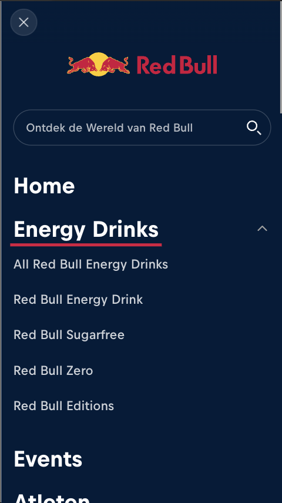
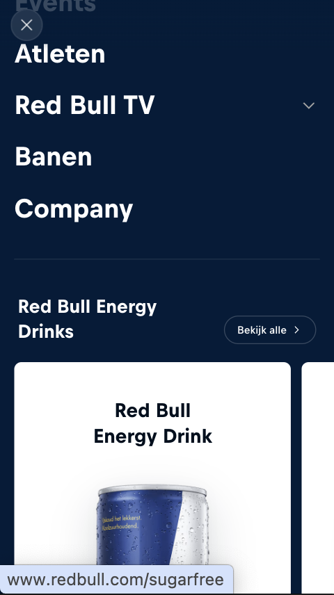
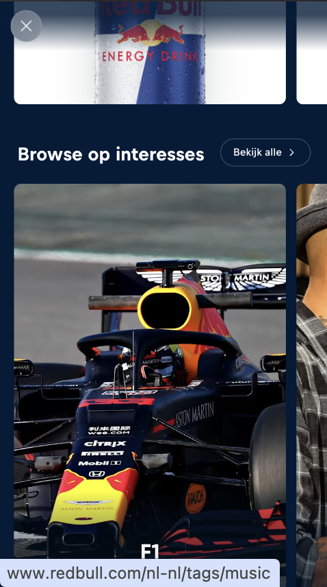
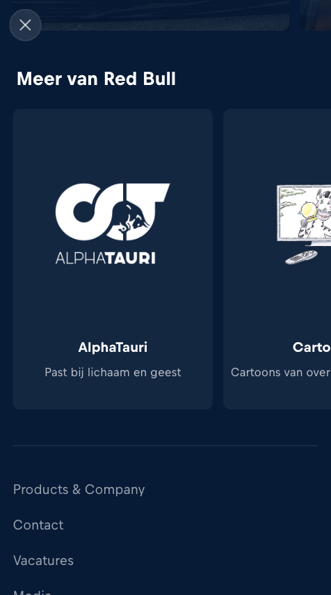
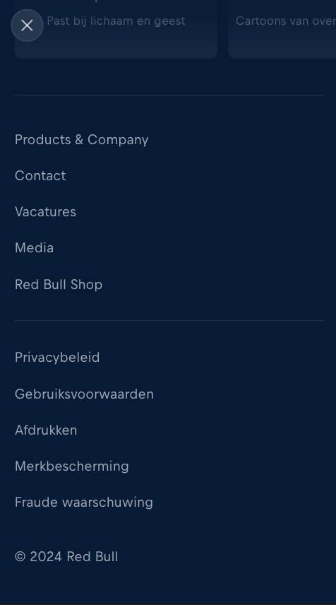

# Procesverslag
Markdown is een simpele manier om HTML te schrijven.  
Markdown cheat cheet: [Hulp bij het schrijven van Markdown](https://github.com/adam-p/markdown-here/wiki/Markdown-Cheatsheet).

Nb. De standaardstructuur en de spartaanse opmaak van de README.md zijn helemaal prima. Het gaat om de inhoud van je procesverslag. Besteedt de tijd voor pracht en praal aan je website.

Nb. Door *open* toe te voegen aan een *details* element kun je deze standaard open zetten. Fijn om dat steeds voor de relevante stuk(ken) te doen.

## Jij

  
uitwerken voor kick-off werkgroep

  ### Auteur:
  Livia Rosenthal

  #### Je startniveau:
  Blauw

  #### Je focus:
  Surface plane
 

## Je website

  
uitwerken voor kick-off werkgroep

  ### Je opdracht:
  https://www.redbull.com/nl-nl/energydrink

  #### Screenshot(s) van de eerste pagina (small screen): 
  hier de naam van de pagina  
  

  #### Screenshot(s) van de tweede pagina (small screen):
  hier de naam van de pagina  
  

  #### Breakdownschets:
  
  
  
  
  
  
  
  
  
 

## Toegankelijkheidstest 1/2 (week 1)

  
uitwerken na test in 2e werkgroep

  ### Bevindingen
  Lijst met je bevindingen die in de test naar voren kwamen:

 
 
 
  

Mijn bevindingen waren dat de screenreader niet prettig was om te gebruiken. De voorgelezen content was onduidelijk en het werd ook in een hoog tempo voorgelezen, wat het lastig maakte om te volgen. Dit zorgde voor verwarring en maakte het navigeren door de website een frustrerende ervaring.

Daarnaast werden afbeeldingen niet voorzien van een beschrijving, waardoor het voor blinden en slechtzienden onmogelijk is om te weten wat er op de afbeeldingen staat. Het ontbreken van duidelijke alt-teksten maakt het niet toegankelijk. Een ander probleem was dat knoppen of menu-items die kunnen worden uitgevouwen, niet automatisch door de screenreader werden uitgevouwen en dus niet worden voorgelezen. Hierdoor is het lastig om de inhoud achter deze knoppen te ontdekken zonder hulp.

Deze problemen maken het bijna onmogelijk voor blinden en slechtzienden om de website op een toegankelijke manier te gebruiken. Het verbeteren van alt-teksten voor afbeeldingen, het automatisch verduidelijken van interactieve elementen zoals knoppen, zijn nodig om de Red Bull website toegankelijk te maken voor iedereen. 

## Breakdownschets (week 1)

  
uitwerken na afloop 3e werkgroep

  ### de hele pagina: 
  

  ### dynamisch deel (bijv menu): 
  
  
  
  
  

  ### wellicht nog een dynamisch deel (bijv filter): 
  

## Voortgang 1 (week 2)

  
uitwerken voor 1e voortgang

  ### Stand van zaken
  hier dit ging goed & dit was lastig (neem ook screenshots op van delen van je website en code) 

  Er zijn een wijzigingen die ik moet doen in de code. Zo moet ik de pixels weghalen uit de 
  HTML code. De hierarchie van de sections beter inrichten, want nu heb ik bijvoorbeeld meerdere h1 elementen op verschillende plekken. Ook kan ik sommige sections benoemen met een class, zodat ik die kan aanspreken in de CSS. Daarnaast moet de alt beschrijving bij een img gedailleerder, zodat het toegankelijker wordt. Ook kwam uit het voortgangsgesprek dat de breakdownschets uitgebreider moet. 
  

  ### Agenda voor meeting
  samen met je groepje opstellen

  | student 1      | student 2          | student 3    | student 4        |
  | ---            | ---                | ---          | ---              |
  | dit bespreken  | en dit             | en ik dit    | en dan ik dat    |
  | en dat ook nog | dit als er tijd is | nog een punt | dit wil ik zeker |
  | ...            | ...                | ...          | ...              |

  ### Verslag van meeting
  hier na afloop snel de uitkomsten van de meeting vastleggen

  - punt 1
  - punt 2
  - nog een punt
  - ...

## Voortgang 2 (week 3)

  
uitwerken voor 2e voortgang

  ### Stand van zaken
  hier dit ging goed & dit was lastig (neem ook screenshots op van delen van je website en code)

  ### Agenda voor meeting
  samen met je groepje opstellen

  | student 1      | student 2          | student 3    | student 4        |
  | ---            | ---                | ---          | ---              |
  | dit bespreken  | en dit             | en ik dit    | en dan ik dat    |
  | en dat ook nog | dit als er tijd is | nog een punt | dit wil ik zeker |
  | ...            | ...                | ...          | ...              |

  ### Verslag van meeting
  hier na afloop snel de uitkomsten van de meeting vastleggen

  - punt 1
  - punt 2
  - nog een punt
- ...

## Toegankelijkheidstest 2/2 (week 4)

  
uitwerken na test in 9e werkgroep

  ### Bevindingen
  Lijst met je bevindingen die in de test naar voren kwamen (geef ook aan wat er verbeterd is):

## Voortgang 3 (week 4)

  
uitwerken voor 3e voortgang

  ### Stand van zaken
  hier dit ging goed & dit was lastig (neem ook screenshots op van delen van je website en code)

  ### Agenda voor meeting
  samen met je groepje opstellen

  | student 1      | student 2          | student 3    | student 4        |
  | ---            | ---                | ---          | ---              |
  | dit bespreken  | en dit             | en ik dit    | en dan ik dat    |
  | en dat ook nog | dit als er tijd is | nog een punt | dit wil ik zeker |
  | ...            | ...                | ...          | ...              |

  ### Verslag van meeting
  hier na afloop snel de uitkomsten van de meeting vastleggen

  - punt 1
  - punt 2
  - nog een punt
  - ...

## Eindgesprek (week 5)

  
uitwerken voor eindgesprek

  ### Je uitkomst - karakteristiek screenshots:
  

  ### Dit ging goed/Heb ik geleerd: 
  Korte omschrijving met plaatjes

  

  ### Dit was lastig/Is niet gelukt:
  Korte omschrijving met plaatjes

  

## Bronnenlijst

  
continu bijhouden terwijl je werkt

  Nb. Wees specifiek ('css-tricks' als bron is bijv. niet specifiek genoeg). 
  Nb. ChatGpT en andere AI horen er ook bij.
  Nb. Vermeld de bronnen ook in je code.

  1. https://codepen.io/shooft/pen/VwJXNEg hamburger menu
  2. https://youtu.be/2_E5uoiLCLY?si=s3TTzIGeZ3Kma-gd horizontaal scrollen met afbeeldingen
  3. bron:https://www.w3schools.com/cssref/css_pr_inset.php inset:0
  4. Bron classlist: https://www.shecodes.io/athena/46410-what-does-classlist-add-do-in-javascript

